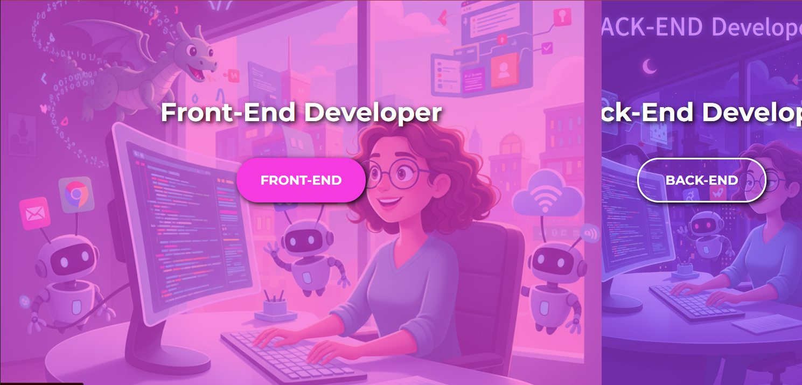

# 🌗 Split Landing Page

A stylish and interactive **split landing page** where two sections dynamically resize on hover.
Built using **HTML**, **CSS**, and **JavaScript**.

---

## ✨ Features

* 2 responsive sections with **75% / 25% split**
* Smooth **hover transition** effect
* Fully responsive layout
* Clean and modern design
* Easy to customize (colors, images, text)

---

## 🚀 Preview

<p align="center">
  
  
  

</p>
 
---

## 🛠️ Technologies Used

* **HTML5** – Page structure
* **CSS3** – Layout, animations, and hover transitions
* **JavaScript (optional)** – Event handling and fine-tuned animations

---


## 📦 Setup

```bash
# Clone the repository
git clone https://github.com/yigitkagankartal/splitLandingPage.git

